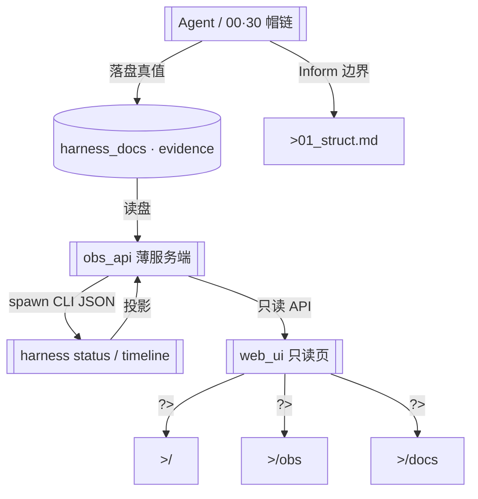

# 顶层流程总图（cyning-harness-web · A0→A）

> **用途**：本仓 Demo 主路径（人类可读简版）。  
> **Phase**：A0 Inform + Phase A 脚手架锚点校对；后续可迁 YAML-first（见 `99_mermaid_protocol.md`）。  
> **边界**：落盘真值在 `docs/**`；Web 只读投影，不写闸。  
> **graph_delta（Phase A）**：边界未变；校对 `web_ui`→`src/**`、`obs_api`→`server/**`（Vite middleware stub；live CLI 属 Phase B）。

## 主路径一句话

**Agent 落盘**（task / invoke / review / evidence）→ **obs_api 读盘 /（A stub · B+ spawn CLI）** → **Web 只读投影**（`/` · `/obs` · `/docs`）。

## Nodes

| ID | Label |
|----|-------|
| AGENT | Agent / 帽链落盘 |
| DOCS | harness_docs · evidence |
| API | obs_api 薄服务端 |
| CLI | harness status / timeline |
| UI | web_ui 只读页 |
| HOME / OBS / DOCPAGE | 路由 `/` · `/obs` · `/docs` |
| STRUCT | 01_struct 模块表 |

## 非路径（明确不做）

- Web / UI **不写** `HG-*` 闸表  
- 聊天 / transcript **不**作 CLOSE / 签收真值（见消费者本体边界）  
- Phase A：`obs_api` 为 stub JSON；**不**在本图展开 live CLI 细节（属 Phase B）
## 关联

- 模块表：[`01_struct.md`](./01_struct.md)
- 本体：[`../meta/ONTOLOGY_web_obs_demo_v1.md`](../meta/ONTOLOGY_web_obs_demo_v1.md)
- SPEC：[`../spec/SPEC-cyning-harness-web-obs-demo_v1.md`](../spec/SPEC-cyning-harness-web-obs-demo_v1.md)
