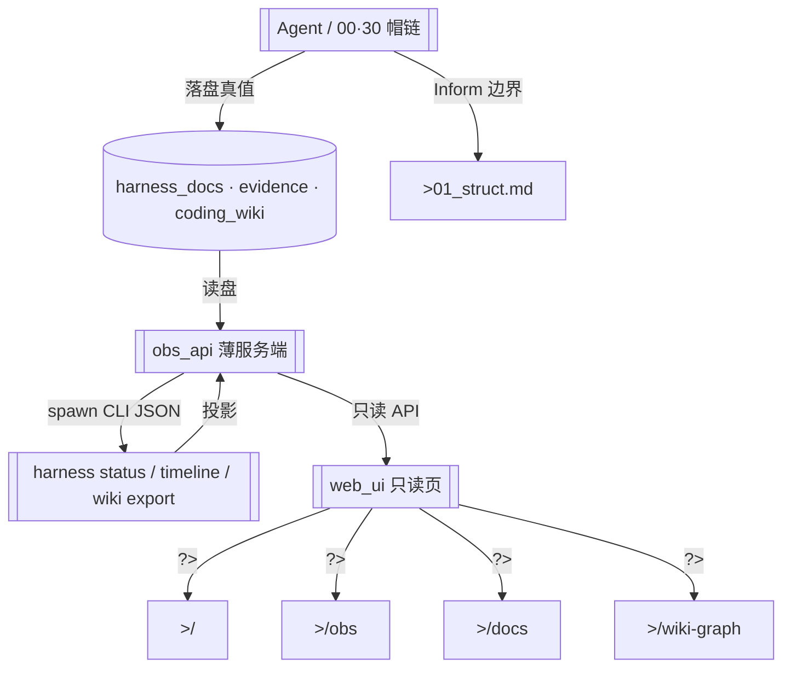

# 顶层流程总图（cyning-harness-web · A0→D + Wiki Graph）

> **用途**：本仓 Demo 主路径（人类可读简版）。  
> **Phase**：A0 Inform + A 脚手架 + B live CLI + C dogfood + D HGM + **2.18 Wiki Graph**；后续可迁 YAML-first（见 `99_mermaid_protocol.md`）。  
> **边界**：落盘真值在 `docs/**`；Web 只读投影，不写闸。  
> **graph_delta（2.18）**：增 `/wiki-graph` 与 `wiki export` 消费；模块表见 `01_struct`。

## 主路径一句话

**Agent 落盘**（task / invoke / review / evidence / coding_wiki）→ **obs_api 读盘 / spawn CLI** → **Web 只读投影**（`/` · `/obs` · `/docs` · `/wiki-graph`）。

## Nodes

| ID | Label |
|----|-------|
| AGENT | Agent / 帽链落盘 |
| DOCS | harness_docs · evidence · coding_wiki |
| API | obs_api 薄服务端 |
| CLI | harness status / timeline / wiki export |
| UI | web_ui 只读页 |
| HOME / OBS / DOCPAGE / WIKI | 路由 `/` · `/obs` · `/docs` · `/wiki-graph` |
| STRUCT | 01_struct 模块表 |

## 非路径（明确不做）

- Web / UI **不写** `HG-*` 闸表  
- 聊天 / transcript **不**作 CLOSE / 签收真值（见消费者本体边界）  
- Phase B：`obs_api` → spawn CLI JSON（仅服务端）；stub 仅为切换旁路；Web **永不**写闸 / 浏览器 npx  
- Phase D：timeline **显式** ingest 策略（默认 off）；status / timeline 同页对照；禁默认静默 ingest  
- 2.18：Wiki 图为 **只读投影**；不嵌 Obsidian 桌面；不在浏览器 `npx upgrade`

## 关联

- 模块表：[`01_struct.md`](./01_struct.md)
- 本体：[`../meta/ONTOLOGY_web_obs_demo_v1.md`](../meta/ONTOLOGY_web_obs_demo_v1.md)
- SPEC：[`../spec/SPEC-cyning-harness-web-obs-demo_v1.md`](../spec/SPEC-cyning-harness-web-obs-demo_v1.md)
- FEEDBACK：[`../evidence/FEEDBACK_harness_2_18_0_from_web_obs_20260728.md`](../evidence/FEEDBACK_harness_2_18_0_from_web_obs_20260728.md)
